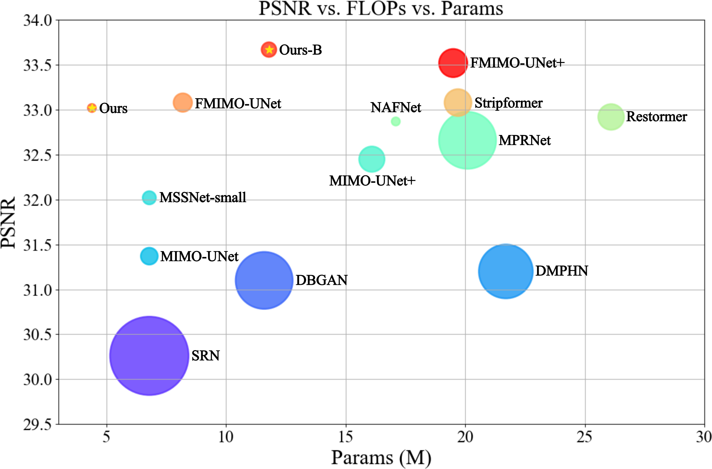
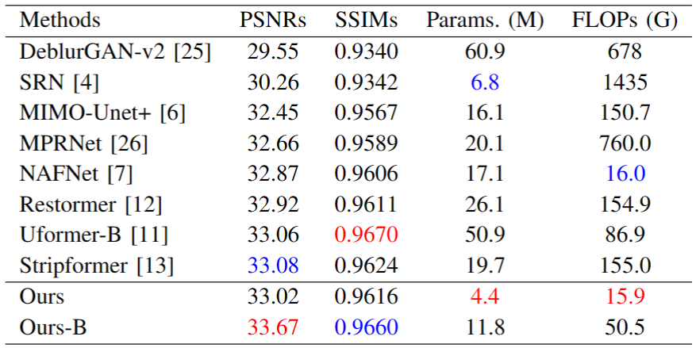
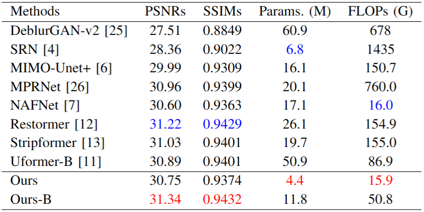
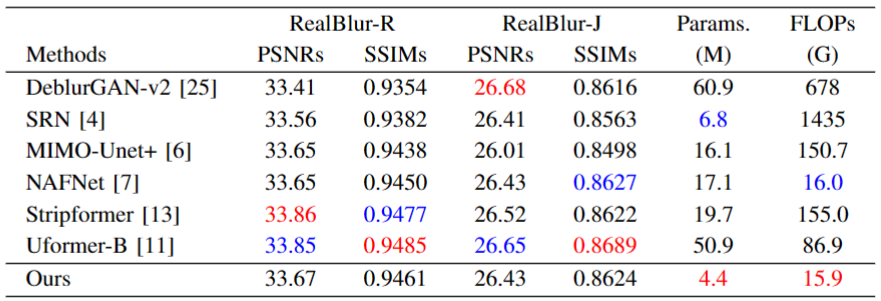
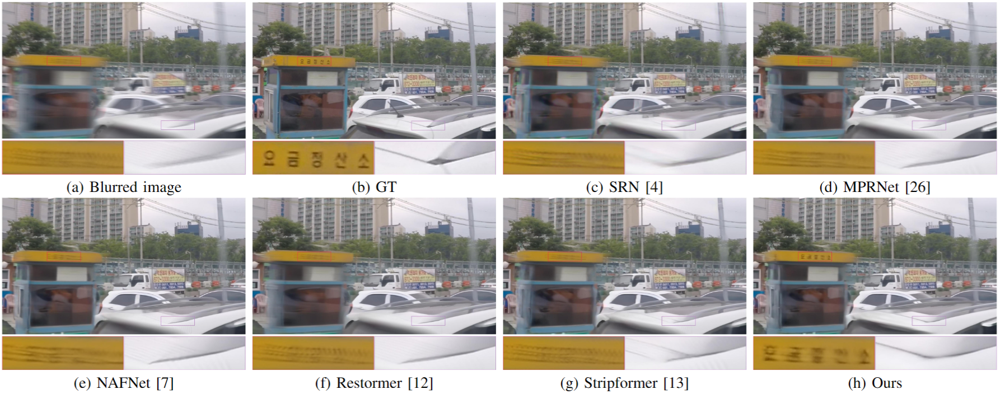
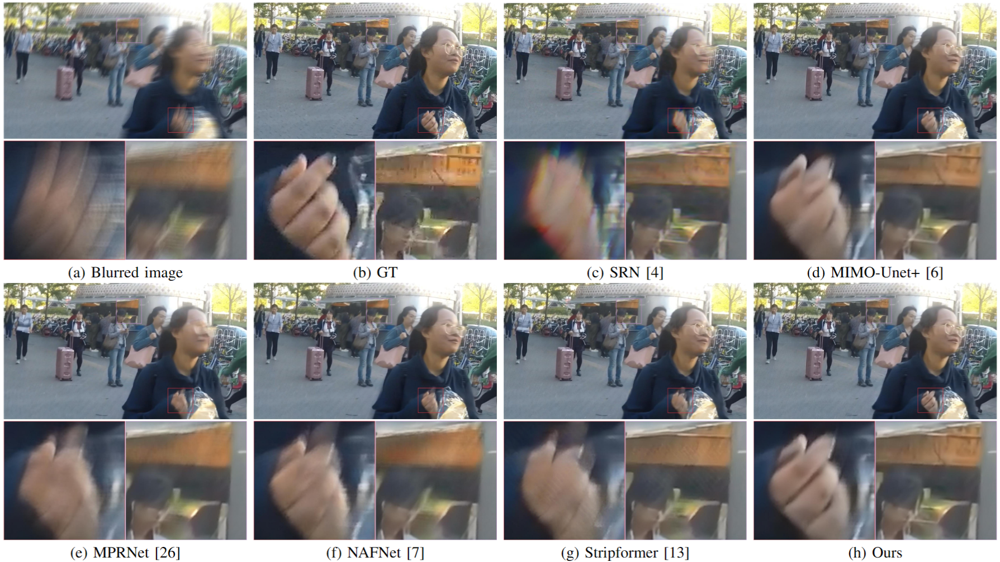
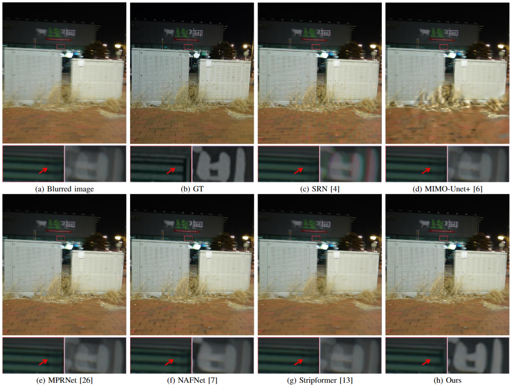

# MDFormer
<!-- >    -->

<!-- > [Zhihao Zhao](https://github.com/Clack2David), [Jinshan Pan](https://jspan.github.io/),
> [IMAG Lab](https://imag-njust.net/), Nanjing University of Science and Technology -->

<!-- --- -->
This repo is a official implementation of "[Lightweight Multi-Dilated Transformer for Image Deblurring]()".

---
## Update

- **2024.01.10**: This repo is created.

---
## Results
- **Model Complexity** (PSNR vs. FLOPs vs. Params)

- Quantitative evaluations on **GoPro** dataset  
 

- Quantitative evaluations on **HIDE** dataset  

- Quantitative evaluations on **RealBlur** dataset  

- Deblurred results on **GoPro** dataset

- Deblurred results on **HIDE** dataset

- Deblurred results on **RealBlur** dataset

